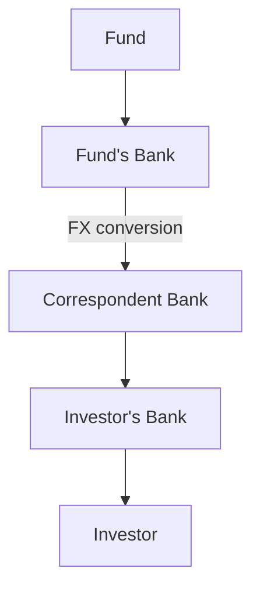
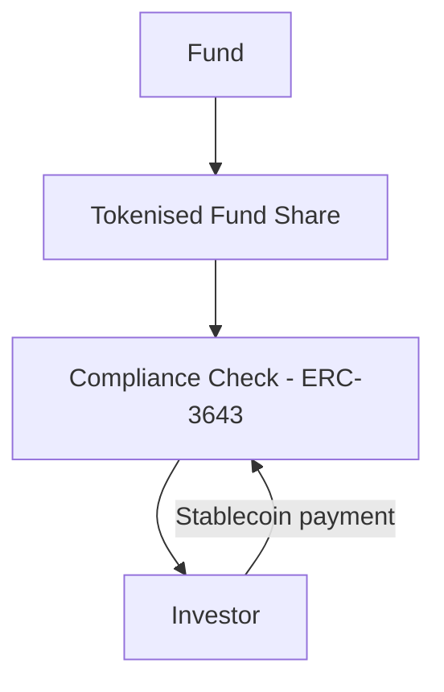

# MAS Project Guardian & UAE Digital Asset Infrastructure: A Tokenised Settlement Case Study

> A case study and architecture exploration of tokenised fund settlement infrastructure connecting Singapore's Project Guardian and the UAE's Digital Dirham, modelling settlement time and cost against correspondent banking.

**Overview:** Cross-border fund settlement between Singapore and the UAE still runs through correspondent banking, a multi-day process that ties up capital and carries counterparty risk at every intermediary bank in the chain. This project models what changes if settlement instead happens atomically on-chain, in line with the direction both MAS's Project Guardian and the UAE's Digital Dirham are already building toward. The result: an estimated 133x reduction in settlement time, with a meaningful cut to both the cost of capital and counterparty exposure on a representative $10M transaction. These are simulation-based estimates grounded in published research and live market data, not measured system performance, methodology and full citations below.

## Problem

Cross-border fund settlement runs on correspondent banking, which carries three structural frictions:

1. **Counterparty risk** - capital is exposed for the full settlement window, typically T+2.
2. **Operational risk** - each hop (fund, correspondent bank, investor's bank) is a manual reconciliation point.
3. **Cost** - AML/KYC checks and FX conversion are repeated at every intermediary.

These frictions matter most for sovereign wealth capital moving between Singapore and the UAE, where efficient allocation into tokenised fund products depends on settlement infrastructure keeping pace with issuance.

This project examines whether tokenised and stablecoin-based settlement can reduce these frictions, using three live reference points:

- **Project Guardian** (Singapore) - MAS-led pilots for tokenised fund subscription and redemption.
- **ADX / ADGM** (UAE) - digital bond issuance and a dedicated digital asset regulatory framework.
- **Digital Dirham** (UAE) - a wholesale CBDC used for settlement.


## Current Settlement Flow

Today, cross-border fund settlement typically flows through **correspondent banking**, introducing settlement delays, operational risk, and multiple intermediary steps.



## Tokenised Settlement Flow

Tokenisation and smart contracts can address this by settling the fund share and payment simultaneously through **atomic delivery-versus-payment (DvP)**, gated by an on-chain compliance check.



## Repo Map

| Area | Files |
|------|-------|
| Case study & architecture | `docs/case-study.md`, `docs/architecture.md` |
| Diagrams | `diagrams/current-settlement.mmd`, `diagrams/tokenised-settlement.mmd` |
| Settlement model | `model/settlement_simulation.py` |
| CBDC model | `model/cbdc_money_demand.py` |
| References | `references/sources.md` |

## Run It

```bash
python3 model/settlement_simulation.py   # Monte Carlo settlement time comparison, opportunity cost, settlement risk exposure
python3 model/cbdc_money_demand.py       # CBDC money-demand illustration
```

Charts save to `model/output/`.

## Results

All figures below are from a Monte Carlo simulation (10,000 trials, triangular distribution per settlement hop). Full output: [model/settlement_simulation.py](model/settlement_simulation.py)

1. Traditional settlement (correspondent banking) has an estimated median of 48.04h (P5 38.95h, P95 57.17h).
2. Tokenised settlement (DvP) has an estimated median of 0.36h (P5 0.24h, P95 0.48h).
3. Median-to-median speedup: approximately **133x**.
4. Estimate precision (95% confidence interval on the simulated mean): traditional 48.06h ± 0.11h; tokenised 0.36h ± 0.001h. This interval reflects the stability of the simulation's average given its input ranges, not confidence in those ranges themselves.
5. On a $10M subscription, tokenised settlement saves an estimated **$1,987** in avoided opportunity cost of capital at the median settlement time, at a live-pulled annualised SOFR (New York Fed).
6. Settlement (Herstatt) risk exposure, at median settlement time and a 0.22% annual investment-grade default probability, is an estimated $120.65 for traditional settlement vs $0.90 for tokenised, a $119.74 reduction on a $10M subscription.

These are illustrative estimates based on published research, not measured system performance.

## References

Full source list with citations available in [references/sources.md](references/sources.md).

Key sources:
- **Bindseil, U. and Pantelopoulos, G.**, ECB Working Paper No. 2693, *Towards the Holy Grail of Cross-Border Payments*
- **Monetary Authority of Singapore**, Project Guardian, *Operationalising Tokenised Funds*
- **Aldasoro, I. et al.**, BIS Bulletin No. 72, *The Tokenisation Continuum*
- **International Monetary Fund**, IMF Notes No. 26/01, *Tokenized Finance*
- **Central Bank of the UAE**, *Project mBridge: Connecting Economies Through CBDC*
- **Central Bank of the UAE**, *CBDC Strategy* (long report, July 2026)
- **BIS CPSS**, *Delivery versus Payment in Securities Settlement Systems* (1992)
- **Glasserman, P.**, *Monte Carlo Methods in Financial Engineering*, Springer (2004)


## Disclaimer


This is a deliberately scoped, illustrative case study, not a production system or a claim of novel research. It's intended to demonstrate applied reasoning across tokenised settlement infrastructure using published, citable sources, not to model a real deployment. Figures throughout are estimates, not measured performance.

This project is independent academic and personal research, conducted outside of any employment relationship. The views, analysis, and models presented here are my own and do not represent the views of any current or former employer. This repository is for educational purposes only and does not constitute financial, legal, or investment advice.